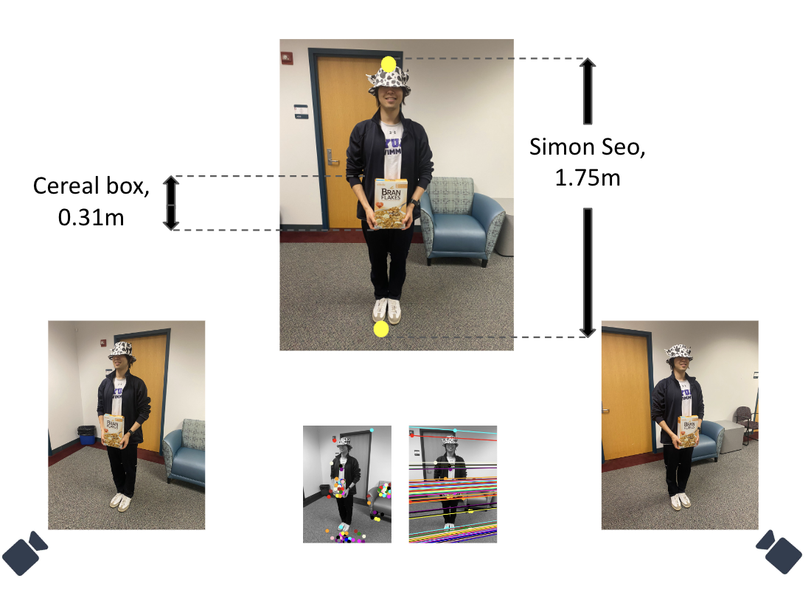
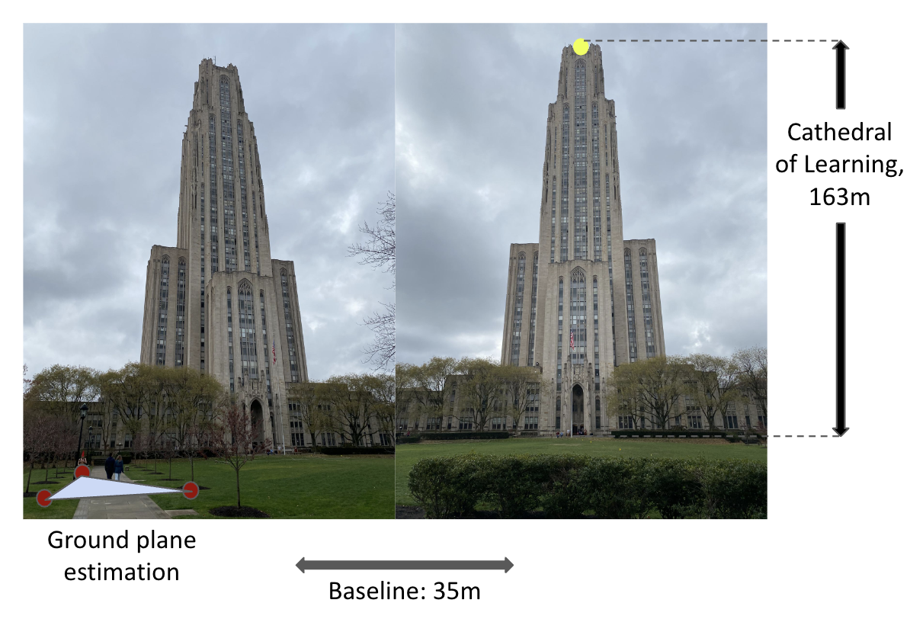
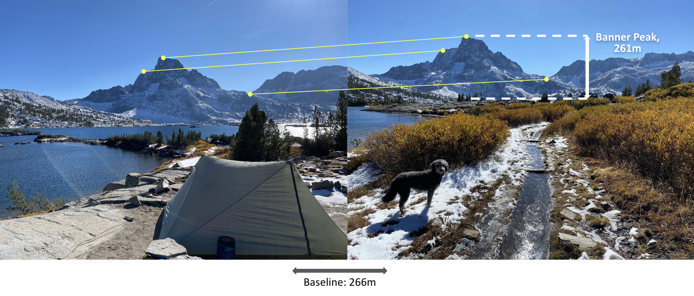

# Height Estimation of Features in the Wild
For full details, please download the PDF report attached to the repo.
Project presentation can be found this [link](https://docs.google.com/presentation/d/1cGpQleLXKF0gDFHSSuaQA6kX0Zme7ceiBH8P8uRt2Ro/edit?usp=sharing).

## Summary
Our project goal is to develop a system for estimating the height of a standing object using geometry-based methods in computer vision (i.e. no sensors and no learning). Our method must only use tools that are available to hikers in the wild, and in particular we focus on using stereo images from a mobile phone. However, we do make some assumptions: that the image has required metadata attached (i.e. longitude, latitude, altitude, and image direction). We use this information to fix the scale ambiguity inherent in our initial 3d scene reconstruction and are able to output height estimations within acceptable margins of error.

We will tackle sub-goals in the following order of increasing difficulty:
1. Height estimation of a person using a known object calibration (`two_view_simon.py`).
2. Height estimation of a building with GPS calibration (`two_view_cathedral.py`).
3. Height estimation of a mountainous feature in the “wild” with GPS calibration (`two_view_mountain.py`).

## Method
1. Stereo image capture of target objects. We obtain sets of varying difficulty, from person to building to mountain.
2. Uncalibrated reconstruction. Find correspondences between the two images using robust feature detection (i.e. SIFT) and RANSAC to account for noise. Estimate fundamental matrix F from above correspondences and camera matrices P1 and P2 for the uncalibrated case. Perform triangulation of target object to obtain points in 3D, up to a projective ambiguity.
3. Bundle adjustment to resolve projective ambiguity using GPS and view direction, with additional camera assumptions as constraints.
4. Height estimation with known GPS distance of baseline (distance between C1 and C2) to obtain correct scale. 

The key to viability of our method in the outdoor context falls in the last two steps, which uses metadata attached to images captured by our mobile phones to calibrate the 3D reconstruction to the real world.

## Results
| Target                | Method                                               | Prior                  | Prior Length | Estimated Height | GT Height | Error |
|-----------------------|------------------------------------------------------|------------------------|--------------|-------------------|-----------|-------|
| Person (Simon Seo) | Two-view reconstruction without rectification       | Cereal box             | 0.31m        | 1.82m             | 1.75m     | 4\%   |
| Building (Cathedral of Learning) | Ground plane estimation, Two-view reconstruction, bundle adjustment | GPS baseline           | 35m          | 146m              | 163m      | 10\%  |
| Mountain (Banner Peak) | Two-view reconstruction, bundle adjustment              | GPS baseline           | 266m         | 295m              | 261m      | 13\%  |
